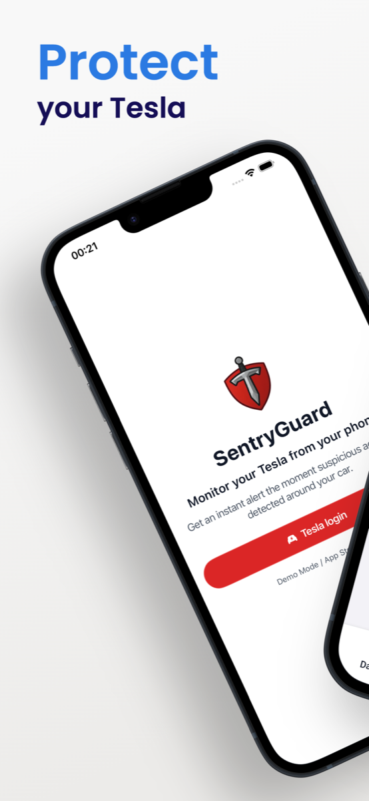
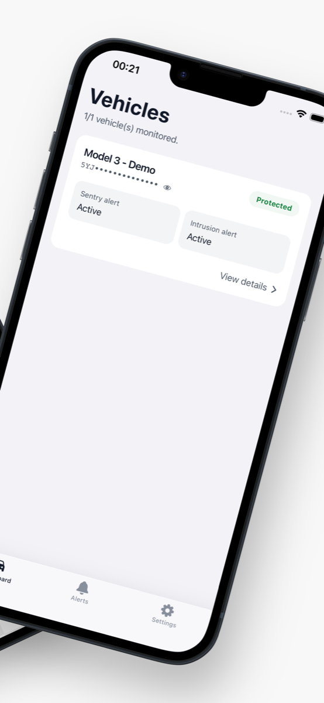
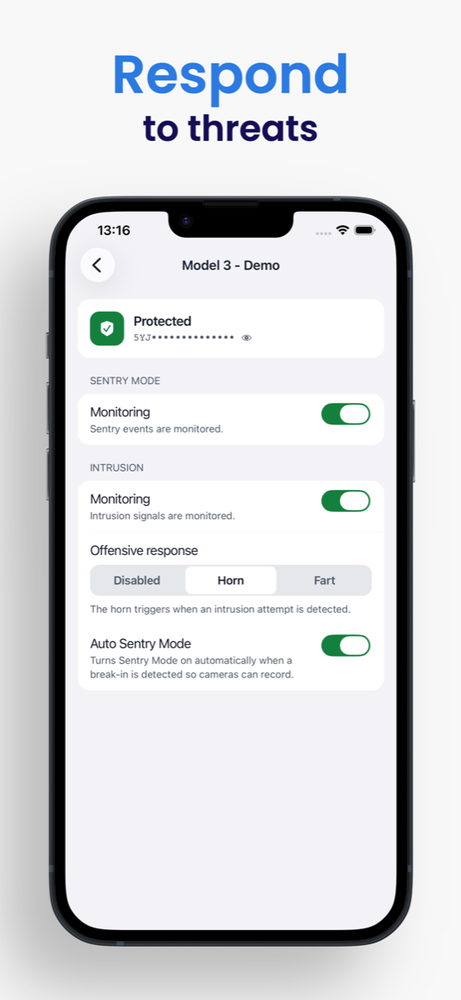
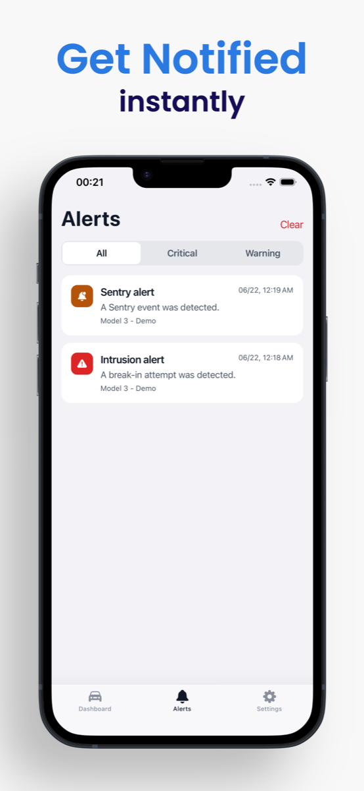
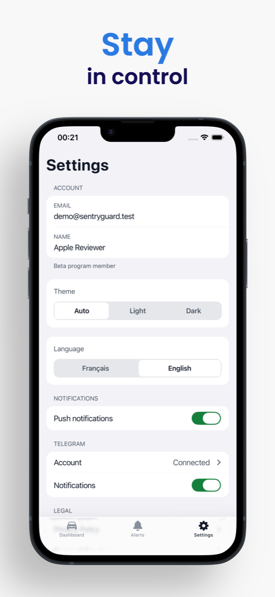
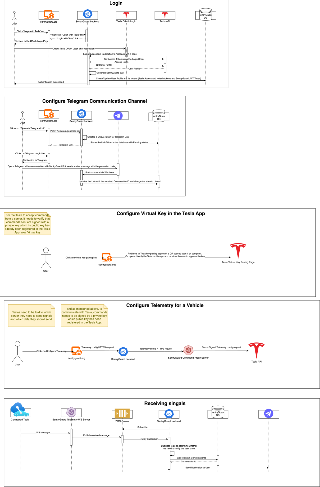

# SentryGuard

[](https://www.gnu.org/licenses/agpl-3.0)
[](https://nodejs.org/)
[](CONTRIBUTING.md)
[](https://www.cloudflare.com)
[](https://sentryguard.org/download)
[](https://sentryguard.org/download)

**Real-time Tesla vehicle monitoring and security alerts via Mobile Push & Telegram**

<p align="left">
  <a href="https://sentryguard.org/download">
    
  </a>
  &nbsp;
  <a href="https://sentryguard.org/download">
    
  </a>
</p>


---

## 💝 Free & Non-Profit Project

> **SentryGuard is currently 100% free and open-source.** This project is run on a non-profit basis and relies entirely on community donations to cover operational costs (hosting, infrastructure, API fees).
>
> 🎯 **Our Commitment:**
>
> - ✅ **Currently free** - no premium features, no paid tiers
> - ✅ **Transparent costs** - detailed expense reports available on request
> - ✅ **Community-driven** - funded by Tesla owners, for Tesla owners
> - ✅ **Open-source** - audit the code, contribute, or self-host
>
> ⚠️ **Sustainability Notice:**  
> If donations no longer cover operational expenses, the service may close, become paid at actual cost (~$0.50/user), or be limited to current users. Your support keeps it free and open for everyone!
>
> **Support the project:**  
> [](https://buymeacoffee.com/sentryguardorg)
>
> Every contribution helps keep SentryGuard running and improves security monitoring for the entire Tesla community! 🙏

---

## 🎥 Demo Video

> **See SentryGuard in action!** Watch our demo video to understand how the platform works.

[](https://youtu.be/dP61FmbPsKI)

_Click the image above to watch the demo video on YouTube_

---

SentryGuard is a comprehensive security monitoring solution for Tesla vehicles. It tracks your vehicle's Sentry Mode status and sends instant push notifications to your mobile phone (iOS & Android) and Telegram alerts when suspicious activity is detected.

## ✨ Features

- 📱 **Native Mobile App (iOS & Android)** - React Native / Expo application with live vehicle dashboard, alert history, dark/light themes, and bilingual support (FR/EN)
- 🔔 **Instant Push Notifications** - High-priority alerts with sound delivered straight to your phone when an event is detected
- 💬 **Telegram Integration** - Instant alerts and interactive control buttons via Telegram deep linking (no manual chatId setup)
- 🔐 **Tesla OAuth Authentication** - Official, secure authentication powered by Tesla with deep-link support
- 🚗 **Multi-Vehicle Support** - Monitor and configure all your Tesla vehicles from a single account
- 📊 **Real-time Telemetry** - Detect Sentry Mode events and intrusion attempts even when Sentry Mode is turned off to save battery
- 🚨 **Break-in Offensive Response** - Automatically honk the horn or trigger boombox sounds when a break-in is detected (configurable per vehicle via mobile, web, or Telegram)
- 🌐 **Responsive WebApp** - Next.js web portal with SSR and clean, modern interface
- 🔒 **Secure by Design** - End-to-end token encryption (AES-256-GCM), server-side session management, and Cloudflare WAF protection

## 📱 Mobile App Showcase

<p align="center">
  
  
  
  
  
</p>

## 🏗️ Architecture

This is an Nx monorepo containing:

- **`apps/api`** - NestJS backend API with TypeORM + PostgreSQL
- **`apps/webapp`** - Next.js frontend with App Router (SSR & SEO-optimized)
- **`apps/mobile`** - Expo / React Native mobile app for iOS, Android and Expo Web
- **`libs/`** - Shared domain libraries (`@sentryguard/telegram-domain`, `@sentryguard/beta-domain`)

Detailed mobile documentation: [apps/mobile/README.md](apps/mobile/README.md)

### Tech Stack

**Mobile (iOS & Android):**

- React Native & Expo
- React Navigation (native stack + pager)
- TanStack Query (React Query)
- Native Push Notifications (`expo-notifications`)
- Secure Storage (`expo-secure-store` / Keychain)
- i18next & react-i18next (FR/EN)
- EAS (Expo Application Services)

**Backend:**

- NestJS - Node.js framework
- TypeORM - ORM with PostgreSQL
- Telegraf - Telegram Bot API
- Tesla Fleet API & Tesla Command Proxy
- Kafka & Fleet Telemetry TLS Ingest

**Frontend (Web):**

- Next.js - React framework with SSR
- React - UI library
- Tailwind CSS - Styling
- TypeScript - Type safety



## 🚀 How to Use

### Option 1: Mobile App (Recommended)

1. **Download the App**: Get SentryGuard on [iOS (App Store) or Android (Google Play)](https://sentryguard.org/download).
2. **Login with Tesla**: Sign in securely with your Tesla account via official OAuth.
3. **Automated Setup**: Grant push notification permissions, detect your vehicles, and pair your Tesla virtual key in a few taps.
4. **Instant Alerts**: Receive immediate, high-priority push notifications for door dings, scratches, or unauthorized handle pulls.
5. **Manage Vehicles & Offensive Response**: Configure horn/boombox break-in responses and alerts directly from the vehicle details screen.

> 💡 **Self-hosting?** You can connect the official store app to your own server: on the mobile login screen, tap the shield logo **5 times** to enter your custom API URL. See the [Self-Hosting Guide](SELF_HOSTING.md#95-connect-mobile-apps-ios--android).

---

### Option 2: WebApp & Telegram

1. **Login with Tesla**: Visit the [web application](https://sentryguard.org) and authenticate.
2. **Configure Vehicles**: Sync your fleet and activate telemetry monitoring for each vehicle.
3. **Link Telegram (Optional)**: Head to the Telegram section, generate your linking token, and start the SentryGuard bot.
4. **Receive Dual-Channel Alerts**: Get alerts in your Telegram chat and toggle offensive responses with inline buttons.

## 🔧 Development

### Run the Mobile App

```bash
# Start Expo Metro bundler (:8081)
npx nx start mobile

# Run directly on iOS simulator or Android emulator
npx nx run-ios mobile
npx nx run-android mobile

# Run Expo Web (:3002)
npx nx serve mobile

# Check mobile types
npx nx typecheck mobile
```

### Run the API

```bash
npx nx serve api
```

### Run the WebApp

```bash
npx nx serve webapp
```

### Build for production

```bash
# API
npx nx build api

# WebApp
npx nx build webapp

# Mobile bundle export
npx nx export mobile
```

### Run tests

```bash
# API tests
npx nx test api

# WebApp tests
npx nx test webapp

# All tests
npx nx run-many -t test
```

### Lint code

```bash
npx nx lint api
npx nx lint webapp
npx nx run-many -t lint
```

## 📊 Project Structure

```bash
SentryGuard/
├── apps/
│   ├── api/                    # NestJS Backend
│   │   ├── src/
│   │   │   ├── app/
│   │   │   │   ├── auth/       # Tesla OAuth & session management
│   │   │   │   ├── telemetry/  # Vehicle telemetry & commands
│   │   │   │   ├── alerts/     # Alert handlers & break-in offensive response
│   │   │   │   ├── offensive-response/ # Offensive response API endpoints & config
│   │   │   │   ├── notifications/ # Expo mobile push notifications
│   │   │   │   └── telegram/   # Telegram bot
│   │   │   ├── entities/       # TypeORM entities
│   │   │   ├── config/         # Centralized configuration
│   │   │   ├── migrations/     # Database migrations
│   │   │   └── common/         # Shared utilities
│   │   └── env.example
│   │
│   ├── webapp/                 # Next.js Frontend (SSR)
│   │   ├── src/
│   │   │   ├── app/            # Next.js pages (App Router)
│   │   │   ├── components/     # React components & store badges
│   │   │   ├── features/       # Domain features (Clean Architecture)
│   │   │   └── core/           # API client, i18n, query provider
│   │   └── tailwind.config.js
│   │
│   └── mobile/                 # React Native / Expo Mobile App (iOS & Android)
│       ├── src/
│       │   ├── core/           # Navigation, theme, session, API client
│       │   ├── features/       # Domain features (Clean Architecture)
│       │   ├── screens/        # Dashboard, Alerts, Vehicle detail, Settings
│       │   └── locales/        # FR/EN translations
│       ├── app.json            # Expo configuration & app permissions
│       └── eas.json            # EAS Build & Store Submit profiles
│
├── libs/                       # Shared domain libraries
│   ├── beta/domain/            # Tesla scopes & error codes
│   └── telegram/domain/        # Telegram-linking use-cases
│
├── nx.json                     # Nx configuration
└── package.json
```

## 🗄️ Database Schema

### Users

- Stores Tesla OAuth tokens (encrypted)
- User profile information

### Vehicles

- Vehicle details (VIN, model, name)
- Telemetry configuration status
- Break-in offensive response per vehicle (Disabled / Honk / Fart)

### Telegram Configs

- Link tokens for deep linking
- Chat IDs for sending alerts
- Mute status and duration

### Push Device Tokens & Preferences

- Native Expo push tokens per device (iOS / Android)
- Notification preferences (Telegram vs Mobile Push toggles, critical-only filter)

## 🔐 Security

- **Token Encryption**: All Tesla access tokens are encrypted using AES-256-GCM with integrity verification before storage
- **Secure Communication**: HTTPS only in production
- **Differentiated Rate Limiting**: Endpoints protected with adaptive rate limits (30-200 req/min depending on sensitivity)
  - Centralized configuration in `apps/api/src/config/throttle.config.ts`
  - No magic numbers - all limits defined as named constants
- **OAuth 2.0**: Secure authentication flow with Tesla
- **No Plaintext Secrets**: All sensitive data encrypted

For detailed security information, see [SECURITY.md](SECURITY.md)

## ☁️ Cloudflare Integration

SentryGuard is designed to work seamlessly with Cloudflare's infrastructure:

### Cloudflare as CDN/Proxy

- **SSL/TLS**: Cloudflare provides automatic HTTPS with flexible SSL options
- **DDoS Protection**: Built-in protection against DDoS attacks
- **Rate Limiting**: Additional edge-level rate limiting complements API-level controls
- **Caching**: Static assets cached at Cloudflare's edge network
- **Analytics**: Real-time analytics and insights

### Setup with Cloudflare

1. **Add your domain to Cloudflare**
2. **Configure DNS records**:
   - `api.yourdomain.com` → Your API server IP
   - `yourdomain.com` → Your webapp server IP
3. **Enable Cloudflare Proxy** (orange cloud)
4. **SSL/TLS Settings**: Set to "Full (strict)" mode
5. **Firewall Rules**: Configure WAF rules for additional security

### Cloudflare Project Alexandria

SentryGuard is part of the [Cloudflare Project Alexandria](https://www.cloudflare.com/lp/project-alexandria/) program, supporting open-source projects with Cloudflare's enterprise features.

## 🤝 Contributing

Contributions are welcome! Please read our [Contributing Guide](CONTRIBUTING.md) and [Code of Conduct](CODE_OF_CONDUCT.md) before submitting a Pull Request.

## 📄 License

This project is licensed under the GNU Affero General Public License v3.0 - see the [LICENSE](LICENSE) file for details.

### Why AGPL-3.0?

We chose AGPL-3.0 to ensure that:

- The software remains free and open source
- Any modifications or improvements are shared with the community
- Network usage (SaaS) requires source code disclosure
- The project benefits from community contributions

## ⚠️ Disclaimer

SentryGuard is not affiliated with, endorsed by, or connected to Tesla, Inc.
Tesla and the Tesla logo are trademarks of Tesla, Inc.

Use this software at your own risk. The authors are not responsible for any damage or issues that may arise from using this software.

## 🆘 Support

- **Issues**: [GitHub Issues](https://github.com/abarghoud/SentryGuard/issues)
- **Contributing**: [CONTRIBUTING.md](./CONTRIBUTING.md)
- **Security**: [SECURITY.md](./SECURITY.md)
- **Self-hosting**: [SELF_HOSTING.md](./SELF_HOSTING.md) — Complete Docker deployment guide
- **Changelog**: [CHANGELOG.md](./CHANGELOG.md) — Read before updating a self-hosted install; breaking changes are listed there

## 🙏 Acknowledgments

- [Tesla](https://developer.tesla.com/) for the Fleet API
- [Telegram](https://telegram.org/) for the Bot API
- [Cloudflare](https://www.cloudflare.com/) for Project Alexandria support
- [Nx](https://nx.dev/) team for the amazing monorepo tools
- [NestJS](https://nestjs.com/) and [Next.js](https://nextjs.org/) communities
- All our [contributors](https://github.com/abarghoud/SentryGuard/graphs/contributors)

## 🌟 Star History

If you find SentryGuard useful, please consider giving it a star ⭐

[](https://star-history.com/#abarghoud/SentryGuard&Date)

## 📊 Project Status

- ✅ **Active Development**: Regular updates and improvements
- ✅ **Community Driven**: Open to contributions
- ✅ **Production Ready**: Used by real Tesla owners
- ✅ **Well Documented**: Comprehensive setup guides

---

Made with ❤️ for Tesla owners who care about their vehicle's security

[Report Bug](https://github.com/abarghoud/SentryGuard/issues) · [Request Feature](https://github.com/abarghoud/SentryGuard/issues) · [Contribute](CONTRIBUTING.md)
